# Agent Ruler

Agent Ruler is a **deterministic reference monitor with confinement runner** for local AI-agent workflows.

Translation?: your agent gets a real workspace to do real work, the risky boundary crossings get **blocked or approval-gated**, and every important decision gets a **receipt** so you can see what happened, without hovering over it all day like an anxious lifeguard.

Made with passion.
To be honest I took long before deciding to publish it. 
I used to keep everything I create for myself 🫣, it wasn't long ago when I decided to be Steadee, go public and share with the world.


If you want the full story (and get the vibe), read: **[about this project](./about%20this%20project.md)**.


---

## What Agent Ruler Gives You

- **Deterministic policy engine** (no LLM making enforcement decisions)
- **Zones + boundaries**: workspace / shared-zone / system-critical / secrets (and user-data depending on your policy)
- **Approval gates** for real risk boundaries (network, export/delivery, elevation, sensitive writes)
- **Receipts + redacted status feed** for auditability and safe polling
- **Local Control Panel UI**: `/`, `/approvals`, `/receipts`, `/policy`, `/runtime`, `/settings`
- **Runner integration (OpenClaw today)** with managed runtime separation
- **Tools adapter** for wait/resume flows (agents can pause on approvals instead of crashing)
- **Optional channel bridge** for approvals (Telegram tested; WhatsApp/Discord not yet tested)

---

## Threat Model (And What It Does Not Do)

The Ruler (yeah that's how I call it, I don't like too much formalities so when you see Ruler I mean Agent Ruler) is built to reduce damage from **prompt injection** and “xyz deleted my files da*n!” moments 👀 by enforcing boundaries **outside the model**.

It is **not**:
- an antivirus
- a kernel EDR
- a magical guarantee that nothing bad can ever happen

You still need basic host hygiene and good judgment on approvals. The Ruler’s job is to make those approvals **rare, meaningful, and auditable**.

---

## Quickstart

Note: I do also recommend to setup OpenClaw outside the Ruler then you can import the configuration during setup, inside the Ruler. Why? Because this allows you to have a safe backup/snapshot where you can constently recreate a new OpenClaw from. 

It also supports Tailscale Network so if you have a tailscale account make sure it's setup so the Ruler will detect it during installation. This will help you accessing the dashboard from anywhere with any machine within your network, I recommend it.

### 1) Install (release install, Linux)

Option A (recommended/manual): Download + verify + run

```bash
# 1) Download release asset + checksums
curl -fsSLO "https://github.com/steadeepanda/agent-ruler/releases/latest/download/agent-ruler-linux-x86_64.tar.gz"
curl -fsSLO "https://github.com/steadeepanda/agent-ruler/releases/latest/download/SHA256SUMS.txt"

# 2) Verify checksum (where you have the .tar.gz file)
sha256sum -c SHA256SUMS.txt

# 3) Extract
tar -xzf agent-ruler-linux-x86_64.tar.gz

# 4) Install binary (+ bundled bridge/docs assets if present) and ensure PATH.
# Replace vX.Y.Z with the release tag you installed.
mkdir -p "$HOME/.local/share/agent-ruler/installs/vX.Y.Z" "$HOME/.local/bin"
install -m 755 agent-ruler "$HOME/.local/share/agent-ruler/installs/vX.Y.Z/agent-ruler"
if [[ -d bridge ]]; then
  mkdir -p "$HOME/.local/share/agent-ruler/installs/bridge"
  cp -a bridge/. "$HOME/.local/share/agent-ruler/installs/bridge/"
fi
if [[ -d docs-site ]]; then
  mkdir -p "$HOME/.local/share/agent-ruler/installs/docs-site"
  cp -a docs-site/. "$HOME/.local/share/agent-ruler/installs/docs-site/"
fi
ln -sfn "$HOME/.local/share/agent-ruler/installs/vX.Y.Z/agent-ruler" "$HOME/.local/bin/agent-ruler"
export PATH="$HOME/.local/bin:$PATH"
```

Option B (installer script): convenient release install 

One-liner variant:

```bash
curl -fsSL "https://raw.githubusercontent.com/steadeepanda/agent-ruler/main/install/install.sh" | bash -s -- --release
```

Safer script variant (if you want to inspect before running):

```bash
curl -fsSLO "https://raw.githubusercontent.com/steadeepanda/agent-ruler/main/install/install.sh"
bash install.sh --release
```

Private repo/fork install vars (optional):
- `GITHUB_TOKEN=<token>`
- `AGENT_RULER_GITHUB_REPO=<owner>/<repo>`

Release update (keeps runtime data/config/files):

```bash
agent-ruler update --check --json
agent-ruler update --yes
```

WebUI also exposes update check/apply in `Control Settings` next to `Ruler Version`.

### 1b) Developer install (`--local`)
Make sure you have the source code first, then from inside the repo run:

```bash
bash install/install.sh --local
```

### 2) Initialize runtime

```bash
agent-ruler init
```

This creates a managed workspace under `~/.local/share/agent-ruler/projects/.../workspace` by default.
Run agent tasks there (or import files into it) to avoid mutating unrelated source trees directly.

### 3) Setup runner wiring

```bash
agent-ruler setup
```

### 4) Run your runner through Agent Ruler

```bash
agent-ruler run -- openclaw gateway
```

### 5) Open Control Panel

```bash
agent-ruler ui
```

Then open: `http://127.0.0.1:4622`

---

## Zones and Flows

You’ll see this pattern everywhere:

- workspace → normal work (fast + boring)
- shared-zone → staged boundary
- deliver → real destination only after the boundary checks

Diagram:
<div style="display:flex; justify-content:center; width:100%;">
  
</div>

---

## Approvals Channels

- **Telegram**: tested ✅  
- **WhatsApp**: untested yet in this release  
- **Discord**: untested yet in this release  

The canonical user surface remains the **local Control Panel WebUI**.

---

## Security Notes

- Receipts are append-only audit records: `state/receipts.jsonl`
- Agent-facing feed is intentionally redacted: `/api/status/feed`
- Runtime internals (policy files, approvals state, receipts internals, managed runtime data) are **not exposed inside the sandbox** by default
- High-risk actions resolve to deterministic outcomes: `allow`, `deny`, `pending_approval` (and quarantine flows where applicable)

---

## Requirements and Tooling

### Required
- Linux host
- `bubblewrap` (`bwrap --version`)

### Optional (depending on workflow)
- Rust toolchain (`cargo`, `rustc`) for `--local` developer installs
- OpenClaw installed on host (runner workflow)

Note: I do also recommend to setup OpenClaw outside the Ruler then you can import the configuration during setup, inside the Ruler. Why? Because this allows you to have a safe backup/snapshot where you can constently recreate a new OpenClaw from.

- Node.js + npm (docs-site build/sync)
- Python 3 (channel bridge runtime/scripts)

---

## Project Links

- GitHub: https://github.com/steadeepanda  
- X: https://x.com/steadeepanda  
- Docs (in-app): `http://127.0.0.1:4622/help/`

---

## Contributing

Contributions are welcome.

Start here:
- [`CONTRIBUTING.md`](./CONTRIBUTING.md)
- [`COMMENT_RULES.md`](./COMMENT_RULES.md)

Commenting standards matter here, especially around policy, confinement, runner wiring, and anything security-sensitive.

---

## Security

If you find a vulnerability, please report it privately first. I'll enjoy working on it to improve the Ruler. 
See [`SECURITY.md`](./SECURITY.md).

---

## License

MIT. See [`LICENSE`](./LICENSE).
